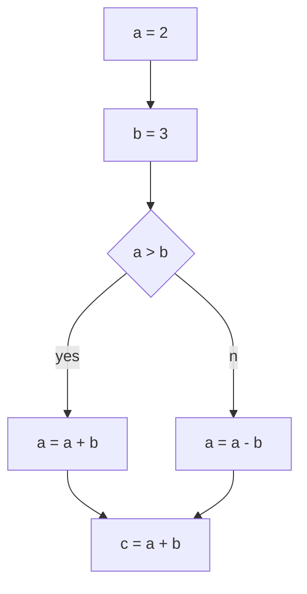

# GraphViewer

##### Веб-приложение для отрисовки различных моделей представлений кода.
##### На вход подается фрагмент исходного кода, название языка и модель представления.
##### На выходе - дерево или граф
```python
a = 2
b = 3
if a > b:
    a = a + b
else:
    a = a - b
c = a + b

```
### python + control flow graph

## Поддерживаемые языки и модели
#### 1) python
- ast
- cfg
#### 2) kotlin
- ast
#### 3) c
- cfg
- ssa
# Установка

## Требования
- [Docker](https://www.docker.com/get-started/)
- python3
- [graphviz](https://graphviz.org/)

## Поддержка Go
Чтобы приложение работало с кодом на Go необходимо собрать образ Docker:
```bash
docker build -t st-dot server/go/src/github.com/nikiens/st-dot
```

## Алгоритм запуска расположен в папке [server](./server/readme.md)