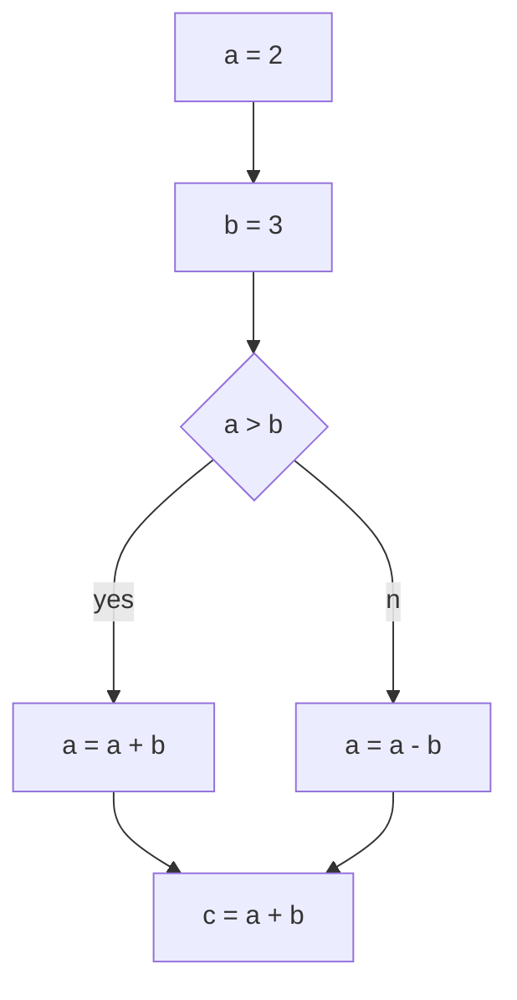

# GraphViewer

##### A web application for rendering various code representation models.
##### The input is a fragment of the source code, the name of the language and the representation model.
##### The output is a tree or graph.
```python
a = 2
b = 3
if a > b:
    a = a + b
else:
    a = a - b
c = a + b

```
### python + control flow graph

## Supported languages and models
#### 1) python
- ast
- cfg
#### 2) kotlin
- ast
#### 3) c
- cfg
- ssa
#### 4) go
- ast
- cfg
# Installation

## Requirements
- [Docker](https://www.docker.com/get-started/)
- python3
- [graphviz](https://graphviz.org/)

## The startup algorithm is located in the folder [server](./server/readmeeng.md)